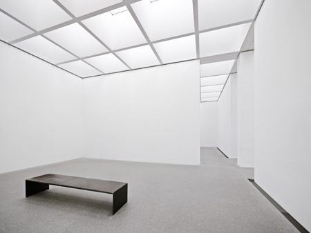

# My First Coding Assignment

## About Me
I am an interdisciplinary artist and eductor whose practice explores the intersection of art, technology, and the environment. My work often incorporates video installations and digital technologies to explore new ways of experiencing and understanding the world around us. I enjoy traveling, discovering new palces and culture, and visiting galleries and museums to experience different forms of art and gain new perspectives. 
## Past Coding Experince
I have limited coding experience, but I have explored a range of digital tools and media through my work as an interdisciplinary artist. My experience includes video, animation, and projection. These experiences have sparked my interest in learning more about programming and exploring it as another tool for my artistic practice.
## Career Goals
1. Develop my programming skills and integrate coding into my artistic practice. 
2. Explore new possibilities at the intersection of art, technology, and science. 
3. Develop innovative ways to incorporate coding and emerging technologies into my research. 
4. Continue developing my interdisciplinary work through experimentation. 

